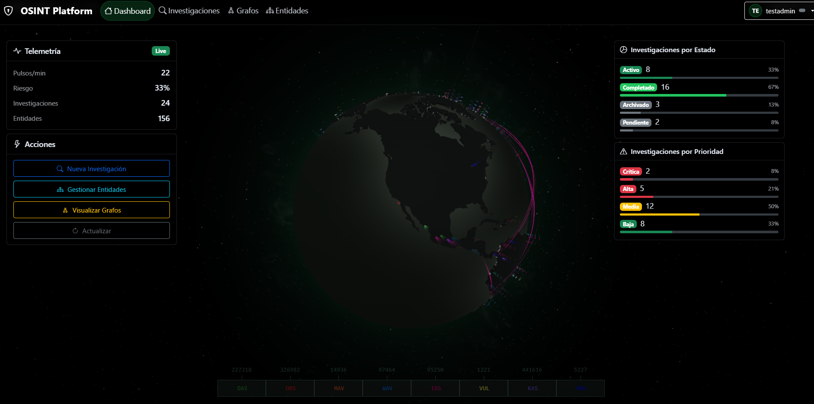

# OSINT Platform

Plataforma de Inteligencia de Fuentes Abiertas (OSINT) diseñada para centralizar, automatizar y visualizar investigaciones de ciberseguridad.

## 📋 Descripción



Esta plataforma permite a investigadores y analistas de seguridad realizar búsquedas OSINT, gestionar investigaciones, ejecutar transformaciones de datos y visualizar relaciones entre entidades (dominios, IPs, correos, personas) en un entorno gráfico interactivo.

El sistema está construido con una arquitectura moderna separando el frontend (React) del backend (Django REST Framework), permitiendo escalabilidad y flexibilidad.

## 🚀 Características Principales

- **Gestión de Investigaciones**: Crear, organizar y seguir casos de investigación.
- **Entidades y Relaciones**: Modelado flexible de datos (Persona, Organización, Dominio, IP, Email, etc.).
- **Visualización de Grafos**: Interfaz interactiva basada en Cytoscape.js para explorar conexiones.
- **Herramientas OSINT Integradas**:
  - **Holehe**: Verificación de cuentas de correo en más de 120 sitios.
  - **Assetfinder**: Descubrimiento de subdominios.
  - **Amass**: Enumeración exhaustiva de subdominios.
  - **Nmap**: Escaneo de puertos y servicios.
  - **Shodan**: Búsqueda de dispositivos conectados (requiere API Key).
  - **crt.sh**: Búsqueda en logs de transparencia de certificados.
- **Arquitectura Data-Driven**: Enfoque en la calidad, normalización y accionabilidad de los datos.

## 🛠️ Tecnologías

### Backend
- **Python 3.12+**
- **Django 4.2** & **Django REST Framework**
- **Celery** & **Redis** (para tareas asíncronas y colas)
- **PostgreSQL** (recomendado para producción) / SQLite (desarrollo)

### Frontend
- **React 18**
- **TypeScript**
- **Vite**
- **Cytoscape.js** (visualización de grafos)
- **Bootstrap 5** & **React-Bootstrap**

## 📦 Instalación y Despliegue

### Requisitos Previos
- Python 3.12 o superior
- Node.js 18 o superior
- Redis (para Celery)
- Herramientas OSINT instaladas en el sistema (nmap, amass, assetfinder, holehe)

### Configuración del Backend

1. **Clonar el repositorio**
   ```bash
   git clone https://github.com/MiltonMenchaca/Osint_platform.git
   cd Osint_platform
   ```

2. **Crear y activar entorno virtual**
   ```bash
   python -m venv venv
   # Windows
   .\venv\Scripts\activate
   # Linux/Mac
   source venv/bin/activate
   ```

3. **Instalar dependencias**
   ```bash
   pip install -r requirements.txt
   ```

4. **Configurar base de datos y migraciones**
   ```bash
   python manage.py migrate
   ```

5. **Crear superusuario**
   ```bash
   python manage.py createsuperuser
   ```

6. **Iniciar servidor de desarrollo**
   ```bash
   python manage.py runserver
   ```

### Configuración del Frontend

1. **Ir al directorio frontend**
   ```bash
   cd frontend
   ```

2. **Instalar dependencias**
   ```bash
   npm install
   ```

3. **Iniciar servidor de desarrollo**
   ```bash
   npm run dev
   ```

El frontend estará disponible en `http://localhost:5173` y el backend en `http://localhost:8000`.

## 🔧 Uso de OSINT Operativo (Scripts)

El proyecto incluye un módulo `osint_operativo` para ejecutar campañas OSINT automatizadas mediante scripts y configuración JSON, ideal para entornos CI/CD o ejecuciones programadas.

1. **Configurar campaña**
   Editar `osint_operativo/config.example.json` o crear uno nuevo.

2. **Ejecutar campaña**
   ```bash
   python osint_operativo/run_osint_operativo.py --config osint_operativo/config.json
   ```

3. **Revisar reportes**
   Los resultados se guardan en `osint_operativo/reportes/` en formatos JSON, TXT y DOCX.

## 🤝 Contribución

1. Fork del repositorio
2. Crear rama de feature (`git checkout -b feature/nueva-herramienta`)
3. Commit de cambios (`git commit -m 'Agrega soporte para X'`)
4. Push a la rama (`git push origin feature/nueva-herramienta`)
5. Crear Pull Request

## 📄 Licencia

Este proyecto está bajo la Licencia MIT. Consulta el archivo `LICENSE` para más detalles.

## ⚠️ Aviso Legal

Esta herramienta está diseñada para uso defensivo, educativo y de investigación autorizada. El usuario es responsable de asegurarse de tener permiso antes de escanear o investigar objetivos. Los desarrolladores no se hacen responsables del mal uso de esta plataforma.
